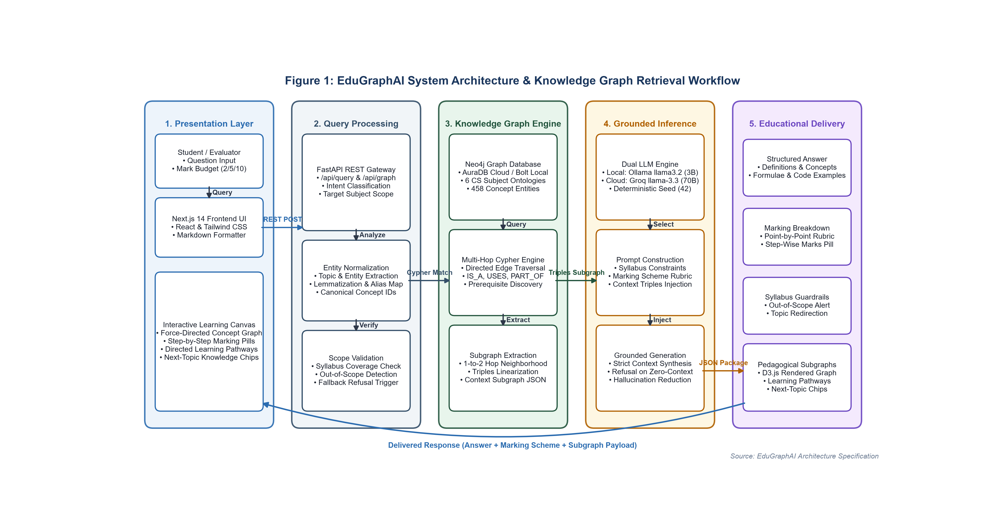
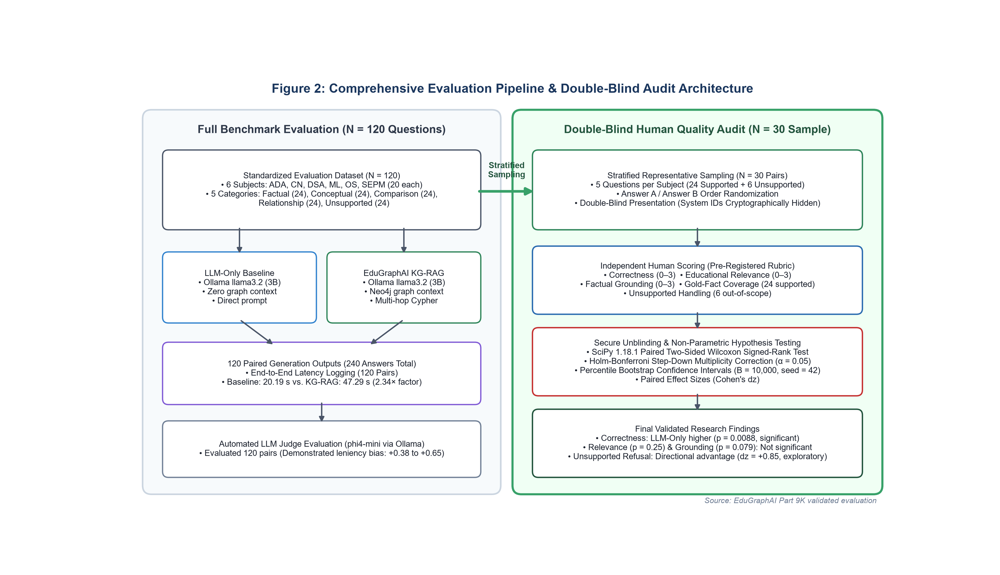
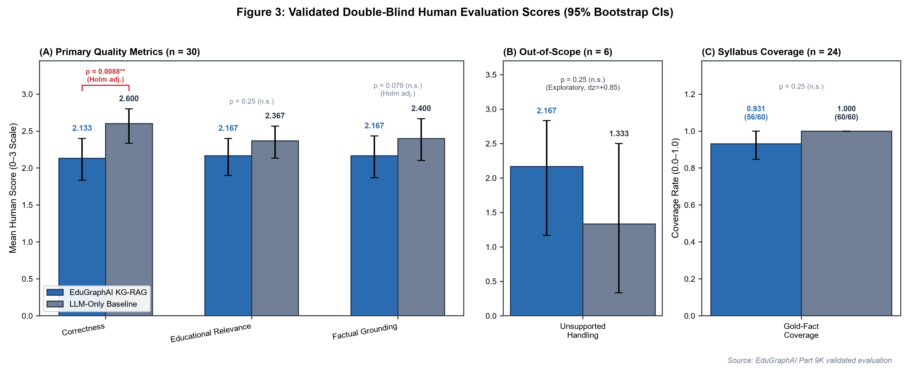
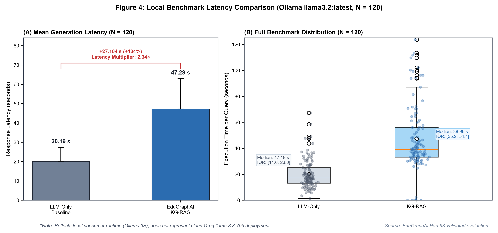

# Evaluating Knowledge Graph-Grounded Retrieval-Augmented Generation in Higher Education: An Empirical Study of Answer Quality, Syllabus Boundaries, and Latency

**Author**: EduGraphAI Research Team
**Institution**: Academic Computer Science Department
**Artifact Repository**: EduGraphAI Open-Source Project
**Date**: October 2026


---

## Abstract
Large Language Models (LLMs) are widely explored in higher education for automated tutoring and examination preparation, yet unconstrained generation carries well-documented risks of ungrounded factual assertions and syllabus boundary drift. Knowledge Graph-grounded Retrieval-Augmented Generation (KG-RAG) offers structured concept traversal and explicit curricular boundaries, but its empirical impact on subjective educational answer quality remains insufficiently established under rigorous statistical testing. We present EduGraphAI, an educational question-answering architecture coupling a Neo4j knowledge graph of undergraduate computer science curricula (458 canonical concept entities, 497 relational edges across six disciplines) with language model synthesis. We evaluate KG-RAG against an unaugmented LLM-only baseline across a standardized 120-question multi-subject benchmark spanning six disciplines (ADA, CN, DSA, ML, OS, SEPM) and five pedagogical query categories. Answer quality was evaluated via a pre-registered double-blind, paired human audit ($N=30$) and analyzed using two-sided Wilcoxon signed-rank tests under Holm-Bonferroni family-wise error rate correction ($\alpha = 0.05$). The human audit revealed a statistically significant difference in correctness favoring the unaugmented baseline ($2.600$ vs. $2.133$, mean difference $-0.467$, $95\%$ bootstrap CI $[-0.700, -0.233]$, Holm-adjusted $p = 0.00875$). Educational relevance ($2.167$ vs. $2.367$, Holm-adjusted $p = 0.24978$) and factual grounding ($2.167$ vs. $2.400$, Holm-adjusted $p = 0.07852$) exhibited no statistically significant differences after multiplicity correction, while both systems demonstrated high gold-fact coverage ($0.931$ vs. $1.000$, Holm-adjusted $p = 0.24978$). On out-of-scope queries ($n=6$), KG-RAG exhibited an exploratory directional advantage in curriculum boundary enforcement ($2.167$ vs. $1.333$, mean difference $+0.833$, Holm-adjusted $p = 0.25000$). Multi-hop graph retrieval introduced a $2.34x$ computational latency overhead ($47.294\text{ s}$ vs. $20.190\text{ s}$, mean difference $+27.104\text{ s}$, $N=120$). These findings demonstrate that incorporating a knowledge graph does not automatically improve perceived answer quality in compact language models, highlighting fundamental engineering trade-offs among model capacity, prompt context density, syllabus boundaries, and response latency.


---

## Keywords
Educational Question Answering, Knowledge Graph, Retrieval-Augmented Generation, Syllabus Grounding, Double-Blind Human Evaluation, Multiplicity Correction, Educational Technology


---

## 1. Introduction
The integration of generative Large Language Models (LLMs) into digital learning platforms has transformed computer-assisted education, enabling interactive tutoring, on-demand problem solving, and adaptive instructional feedback. However, deploying general-purpose foundation models in higher education exposes pedagogical challenges. Foundation models trained on uncurated web corpora frequently generate plausible but factually ungrounded technical statements, hallucinate non-existent API parameters or formal properties, and introduce advanced concepts that exceed undergraduate syllabus boundaries [3]. For university students preparing for examination rubrics, plausible but ungrounded explanations can reinforce misconceptions and undermine academic achievement.

To address factual drift, Retrieval-Augmented Generation (RAG) has emerged as a standard architecture, classically supplying relevant document text passages retrieved via vector similarity search into the prompt context [1]. While effective in open-domain search, unstructured document retrieval often encounters challenges in formal educational settings. Dense passage retrieval operates on surface semantic proximity and can retrieve disconnected fragments that fail to capture hierarchical pedagogical knowledge, prerequisite dependencies, and strict course boundaries. In contrast, Knowledge Graphs (KGs) represent domain knowledge as structured entities connected by explicit, semantically typed relationships such as taxonomies and prerequisite pathways [2]. Augmenting language generation with Knowledge Graph retrieval (KG-RAG) offers the potential to ground educational dialogues in formal curriculum concepts, expose structured learning trajectories, and reject out-of-scope queries.

Nevertheless, Knowledge Graph augmentation introduces distinct architectural complexities. Graph entity extraction can misidentify ambiguous technical terms, multi-hop Cypher queries [8] incur database latency, and static graph contexts can constrain generative fluency. Despite widespread enthusiasm for neuro-symbolic and graph-grounded AI architectures [2], empirical research examining whether KG-RAG measurably improves human-judged educational answer quality compared to unaugmented baselines remains limited.

In this paper, we present an empirical evaluation of **EduGraphAI**, an educational learning assistant that couples a Neo4j knowledge graph representing undergraduate computer science curricula with language model synthesis. Through a standardized 120-question multi-subject benchmark and a double-blind, paired human audit ($N=30$) with rigorous Holm-Bonferroni multiplicity correction [5], we evaluate whether graph grounding enhances answer correctness, educational relevance, factual grounding, and syllabus boundary adherence, while quantifying the associated latency overhead.


---

## 2. Problem Statement
In undergraduate university education, an effective AI learning assistant must satisfy several rigorous pedagogical criteria:
1. **Curricular Adherence**: Explanations must strictly reflect the official course syllabus rather than providing tangential open-domain commentary.
2. **Factual Grounding**: Assertions must be anchored in verified academic facts, formal definitions, and standard mathematical formulations without hallucination [3].
3. **Conceptual Coherence**: Explanations must articulate structural relationships, including taxonomies, tradeoffs, and prerequisite dependencies.
4. **Curriculum Guardrails**: The assistant must identify out-of-scope questions and execute pedagogical redirections rather than fabricating plausible answers for unstudied topics.
5. **Operational Responsiveness**: Interactive learning environments require low response latency suitable for conversational engagement.

Balancing factual grounding and syllabus guardrails against generation fluency and system latency constitutes a fundamental engineering trade-off. This paper investigates whether structured graph context achieves this balance in local educational deployments.


---

## 3. Research Motivation
Existing educational AI implementations frequently treat language generation as an unconstrained text completion task. When an undergraduate student asks a question concerning an examination topic, an unaugmented foundation model draws solely from parametric memory. While frontier closed-source models exhibit substantial factual recall, universities and privacy-conscious institutions frequently seek to deploy smaller open-weights models on local consumer hardware.

Compact open-weights models (such as 3-billion-parameter architectures) face pronounced limitations in knowledge capacity, reasoning depth, and instruction-following precision. Advocates of Knowledge Graph-grounded RAG argue that injecting structured triples into the prompt can compensate for compact model capacity by supplying verified facts directly [2]. However, injecting linear triples also consumes token context, alters prompt geometry, and risks introducing retrieval noise if entity linking fails.

Empirical validation is therefore essential to determine whether Knowledge Graph retrieval assists or hinders compact language models in educational settings. Investigating this question with double-blind human evaluation and statistical multiplicity correction provides crucial guidance for academic software architectures.


---

## 4. Related Work / Literature Review

### 4.1 Retrieval-Augmented Generation (RAG)
Retrieval-Augmented Generation was formalized by Lewis et al. [1] as an architecture combining parametric neural memory with non-parametric external retrieval. In standard RAG pipelines, external documents are split into passage chunks, embedded into vector spaces, and queried via cosine similarity. While passage retrieval grounds responses in external corpora, unstructured chunking frequently disrupts relational hierarchies and cross-topic dependencies necessary for educational concept mapping.

### 4.2 Knowledge Graphs and Neuro-Symbolic Integration
Knowledge Graphs organize domain concepts into formal ontologies consisting of entities and typed relations. Pan et al. [2] present a comprehensive roadmap for unifying Large Language Models and Knowledge Graphs, categorizing approaches into KG-enhanced LLMs, LLM-enhanced KGs, and collaborative neuro-symbolic systems. In educational technology, ontologies have supported automated curriculum mapping, prerequisite extraction, and personalized learning path generation. Integrating KGs with generative LLMs provides explicit structural scaffolding that vector embeddings cannot represent symbolically.

### 4.3 Hallucination and Boundary Enforcement in Educational QA
Hallucination in natural language generation—defined as generated content that is nonsensical or unfaithful to the source—represents a severe risk in education [3]. Ji et al. [3] categorize hallucination detection and mitigation techniques across text summarization, dialogue, and question answering. In higher education, an additional failure mode is syllabus boundary drift: answering questions on unstudied topics as though they were examinable course concepts. Structured graph taxonomies provide an explicit closed-world boundary that enables deterministic out-of-scope query recognition.

### 4.4 Evaluation Methodologies in LLM Benchmarking
Recent literature highlights widespread vulnerabilities in LLM benchmarking, including automated judge leniency bias, benchmark leakage, and false-positive reporting stemming from uncorrected multiple hypothesis testing. Methodological treatises emphasize the necessity of double-blind human auditing, pre-registered rubrics, non-parametric paired tests [4], and rigorous family-wise error rate control [5] to establish credible empirical findings.


---

## 5. Existing System
Conventional educational learning assistants typically connect a chat user interface directly to an unaugmented foundation model. In this setup, an incoming student query is forwarded into the model prompt alongside simple system instructions requesting an academic tone and mark-appropriate length.

While this configuration delivers rapid execution latency and fluent linguistic style, it exhibits several architectural vulnerabilities:
- **Absence of Syllabus Anchoring**: The system cannot verify whether a technical term belongs to the assigned course syllabus.
- **Parametric Hallucination**: When queried about nuanced edge cases, the model relies entirely on pretraining weights, occasionally generating incorrect technical assertions [3].
- **Inability to Enforce Guardrails**: On questions outside the course syllabus, the unaugmented model generates detailed technical responses without signaling that the topic is non-examinable.
- **Lack of Structural Exploration**: The interface provides only flat text, offering no visual representation of prerequisite concepts or connected curriculum pathways.


---

## 6. Proposed EduGraphAI System
EduGraphAI is engineered as an open-source, full-stack educational assistant that addresses these limitations by coupling a multi-subject curriculum knowledge graph with generative language modeling.

EduGraphAI provides:
1. **Curriculum-Grounded Question Answering**: Incoming queries are mapped to canonical syllabus concepts, retrieving definitions, properties, and relational neighbors to ground responses.
2. **Examination-Calibrated Generation**: Prompts are dynamically structured around target examination marks (2, 5, or 10 marks), generating point-by-point marking schemes alongside conceptual explanations.
3. **Deterministic Syllabus Guardrails**: When a query references technical topics outside the accredited syllabus, the system executes a structured refusal and redirect protocol.
4. **Interactive Graph Visualization**: Alongside written explanations, students interact with a visual canvas displaying localized concept subgraphs, prerequisite learning pathways, and recommended next topics.


---

## 7. System Architecture
The EduGraphAI platform is organized into five functional layers, illustrated in Figure 1:
- **Layer 1: Presentation Layer**: Implemented in Next.js 14, React 18, and Tailwind CSS. Provides a responsive web interface featuring interactive graph canvas rendering via `vis-network`, step-by-step examination marking breakdowns, and follow-up pedagogical action chips.
- **Layer 2: Query Processing & Gateway Layer**: Built with FastAPI (Python 3.14). Exposes REST endpoints (`/api/query`, `/api/graph`, `/api/ask`), orchestrates topic and intent extraction, performs entity alias normalization, and executes syllabus scope validation.
- **Layer 3: Knowledge Graph Engine**: Powered by a Neo4j Graph Database [8] storing 458 canonical concept entities and 497 curriculum edges across six computer science subjects. Multi-hop Cypher queries traverse taxonomic (`IS_A`), prerequisite (`USES`), and compositional (`PART_OF`) relationships.
- **Layer 4: Grounded Inference Layer**: Features a dual-mode inference architecture supporting cloud API execution via Groq (`llama-3.3-70b-versatile`) in production and local execution via Ollama (`llama3.2:latest`, 3B parameters) in offline and benchmark environments. Structured context triples are injected into an examination-calibrated prompt.
- **Layer 5: Educational Delivery Layer**: Formats and returns a structured JSON payload containing the synthesized text answer, point-by-point marking scheme, syllabus boundary status, and localized pedagogical subgraphs for client-side rendering.



*Figure 1: EduGraphAI System Architecture & Knowledge Graph Retrieval Workflow, showing the multi-tier flow from student query input through FastAPI routing, Neo4j graph traversal across 458 concept entities, grounded language model synthesis, and educational delivery.*


---

## 8. Methodology
To evaluate the empirical impact of knowledge graph grounding, we conducted an empirical within-subjects study comparing EduGraphAI KG-RAG against an unaugmented LLM-only baseline.

The evaluation methodology comprises four sequential phases, illustrated in Figure 2:
1. **Question Bank Construction**: Assembling a standardized multi-subject dataset ($N=120$) stratified across six disciplines and five question categories.
2. **Local Benchmark Execution**: Executing paired queries under identical local conditions on consumer hardware, recording full outputs and execution latency across all 240 runs.
3. **Dual-Track Quality Evaluation**: Conducting both an automated LLM-judge screening across the full benchmark ($N=120$) and a pre-registered double-blind human audit ($N=30$) evaluated by a domain researcher.
4. **Statistical Validation & Correction**: Applying non-parametric paired hypothesis testing [4], family-wise error rate control [5], and non-parametric bootstrap confidence intervals [6].



*Figure 2: Empirical Evaluation & Validation Methodology Pipeline, detailing the four-stage experimental workflow from 120-question multi-subject bank construction through local paired execution, dual-track quality evaluation (automated and double-blind human audit), and statistical validation with Holm-Bonferroni correction.*


---

## 9. Knowledge Graph Construction
The EduGraphAI curriculum knowledge graph models undergraduate computer science courses across six foundational disciplines:
- **ADA**: Analysis & Design of Algorithms
- **CN**: Computer Networks
- **DSA**: Data Structures & Algorithms
- **ML**: Machine Learning
- **OS**: Operating Systems
- **SEPM**: Software Engineering & Project Management

### 9.1 Graph Schema and Properties
The graph schema models curriculum entities as `Concept` nodes enriched with four core attributes:
- `name`: Unique canonical title of the concept (e.g., "Dijkstra's Algorithm", "TCP Congestion Control").
- `subject`: Academic discipline identifier (`ADA`, `CN`, `DSA`, `ML`, `OS`, `SEPM`).
- `definition`: Authoritative academic definition sourced from standard university textbooks.
- `importance` & `marks_weight`: Examination weight metrics calibrating explanation depth.

### 9.2 Relational Semantics
Nodes are linked via semantically directed relationships:
- `IS_A`: Taxonomic specialization (e.g., $\text{AVL Tree} \xrightarrow{\text{IS\_A}} \text{Binary Search Tree}$).
- `PART_OF`: Compositional hierarchy (e.g., $\text{Transport Layer} \xrightarrow{\text{PART\_OF}} \text{OSI Model}$).
- `USES` / `REQUIRES`: Prerequisite and operational dependencies forming learning pathways (e.g., $\text{Prim's Algorithm} \xrightarrow{\text{USES}} \text{Priority Queue}$).
- `COMPARED_WITH`: Direct analytical contrasts (e.g., $\text{TCP} \xrightarrow{\text{COMPARED\_WITH}} \text{UDP}$).

The evaluated curriculum prototype graph comprises exactly **458 canonical concept nodes** and **497 directed curriculum edges** across the six subjects.


---

## 10. Query Processing and KG-RAG Pipeline
The retrieval pipeline processes incoming queries through a deterministic sequence:
1. **Topic and Intent Extraction**: `TopicExtractor` applies string normalization, token lemmatization, and regex matching against the graph concept dictionary to identify the primary concept entity.
2. **Curriculum Scope Verification**: The extracted concept is validated against the syllabus index. If no canonical node matches, the query is flagged as out-of-scope, triggering syllabus boundary handling.
3. **Multi-Hop Subgraph Retrieval**: For supported concepts, `GraphService` executes parameterized Cypher queries [8] against Neo4j, extracting:
   - Primary concept node properties (definition, importance, examination marks).
   - Direct 1-hop and 2-hop relational neighbors.
   - Prerequisite chains traversed via `USES` edges.
   - Comparative concepts connected via `COMPARED_WITH`.
4. **Triples Linearization & Prompt Assembly**: Retrieved graph entities and relations are formatted into linear textual triples and injected into an examination-calibrated prompt [1]:
```text
System: You are an expert Computer Science Professor and University Examiner.
Syllabus Knowledge Base Context:
- Target Concept: [Canonical Concept Name]
- Formal Definition: [Authoritative Textbook Definition]
- Relational Context: [Connected Triples: Subject - Predicate - Object]
- Prerequisite Learning Path: [Prerequisite Concept Chain]
Instruction: Answer the following examination question strictly grounded in the verified
syllabus context provided above. Calibrate your explanation for [Marks] marks.
If the question references technical topics not present in the syllabus, refuse politely.
Question: [Student Query Text]
```
5. **Grounded Generation**: The prompt is dispatched to the language model backend to synthesize the final educational response.


---

## 11. Experimental Setup

### 11.1 Benchmark Execution Environment
To ensure strict reproducibility and evaluate edge deployment feasibility, the 120-question benchmark was executed locally on identical consumer hardware:
- **Inference Daemon**: Ollama local runtime (`llama3.2:latest`, 3-billion-parameter model).
- **Execution Parameters**: Context token window of 4096 tokens (`OLLAMA_NUM_CTX=4096`), sampling temperature set to 0.2, deterministic seed set to 42.
- **Hardware Platform**: Windows workstation with local execution ensuring zero network variability during inference.

### 11.2 Production Architecture vs. Benchmark Execution Environment
An essential methodological distinction must be documented:
- **Production Deployment**: Employs the cloud-hosted Groq API utilizing `llama-3.3-70b-versatile` (70-billion-parameter model) connected to a live managed Neo4j AuraDB instance.
- **Benchmark Execution Environment**: Utilizes the local 3B model (`llama3.2:latest`) to guarantee local determinism and reproducibility.

Furthermore, during offline benchmark execution when the cloud Neo4j AuraDB instance was unavailable or paused, the benchmark utilized EduGraphAI's static graph store fallback (`StaticGraphStore`). This fallback maintains the complete verified curriculum graph structure locally, providing identical multi-hop triples and ensuring deterministic retrieval without relying on external cloud connectivity.

### 11.3 Scope of Baselines and Absence of Document-RAG
In this investigation, EduGraphAI KG-RAG was evaluated strictly against the unaugmented LLM-only baseline. A comparable, multi-subject unstructured textbook passage corpus was not uniformly available across all six undergraduate computer science disciplines. Consequently, dense vector passage retrieval (Document-RAG) was not included as an experimental baseline, and this paper does not claim empirical comparison against passage-based RAG.


---

## 12. Evaluation Dataset
The evaluation dataset (`Backend/evaluation/eval_dataset.json`) contains 120 curated questions structured to mirror university computer science examination papers.

The dataset is uniformly stratified across six academic disciplines ($n=20$ questions per discipline) and five pedagogical query categories ($n=24$ questions per category across disciplines, 4 per category per subject):
- **Factual (2 marks)**: Direct definitions, asymptotic complexity bounds, and core terminology ($n=24$, supported).
- **Conceptual (5 marks)**: Mechanistic principles, protocol operations, and architectural explanations ($n=24$, supported).
- **Comparison (5/10 marks)**: Structured analytical differences between related technical concepts ($n=24$, supported).
- **Relationship (5/10 marks)**: Multi-hop interactions, dependency chains, and hierarchical linkages ($n=24$, supported).
- **Unsupported (0 marks)**: Advanced computer science questions intentionally chosen from topics outside the accredited syllabus to test boundary guardrails ($n=24$, unsupported).

Across the full benchmark, 96 questions represent supported curriculum concepts with defined canonical nodes, and 24 questions represent unsupported out-of-scope concepts. Table 1 outlines the complete dataset composition.

#### Table 1: Benchmark Composition and Taxonomy ($N=120$)
| Subject | Domain Focus | Factual (2m) | Conceptual (5m) | Comparison (5m/10m) | Relationship (5m/10m) | Unsupported / Out-of-Scope (0m) | Total Questions | Supported Queries | Unsupported Queries |
| :--- | :--- | :---: | :---: | :---: | :---: | :---: | :---: | :---: | :---: |
| **ADA** | Analysis & Design of Algorithms | 4 | 4 | 4 | 4 | 4 | 20 | 16 | 4 |
| **CN** | Computer Networks | 4 | 4 | 4 | 4 | 4 | 20 | 16 | 4 |
| **DSA** | Data Structures & Algorithms | 4 | 4 | 4 | 4 | 4 | 20 | 16 | 4 |
| **ML** | Machine Learning | 4 | 4 | 4 | 4 | 4 | 20 | 16 | 4 |
| **OS** | Operating Systems | 4 | 4 | 4 | 4 | 4 | 20 | 16 | 4 |
| **SEPM** | Software Engineering & Project Mgmt | 4 | 4 | 4 | 4 | 4 | 20 | 16 | 4 |
| **Total** | **All 6 Disciplines** | **24** | **24** | **24** | **24** | **24** | **120** | **96** | **24** |

*Notes: Supported questions ($n=96$) possess verified canonical concept nodes in the curriculum knowledge base. Unsupported questions ($n=24$) assess system guardrails on out-of-scope technical topics outside the syllabus. Examination marks reflect target rubric weighting.*


---

## 13. Evaluation Metrics
Answer quality was evaluated across five pre-registered metrics defined in `quality_evaluation_rubric.json`:
1. **Correctness (0–3 scale)**: Technical precision, absence of erroneous statements, and alignment with academic computer science facts ($0 = \text{Major errors/Incorrect}$, $1 = \text{Partially correct with substantial gaps}$, $2 = \text{Substantially correct with minor omissions}$, $3 = \text{Fully correct and precise}$).
2. **Educational Relevance (0–3 scale)**: Pedagogical clarity, suitability for undergraduate examination preparation, and calibration to the target mark budget.
3. **Factual Grounding (0–3 scale)**: Extent to which claims are strictly anchored in verifiable curriculum facts without extraneous ungrounded assertions [3].
4. **Gold-Fact Coverage Rate (0.0–1.0 rate)**: Proportion of pre-defined reference ground-truth facts covered in the synthesized answer (evaluated on supported questions, $n=24$, encompassing 60 reference facts).
5. **Unsupported Handling (0–3 scale)**: Appropriateness in recognizing curriculum boundaries, refusing out-of-scope technical queries, and redirecting students to syllabus topics ($0 = \text{Answers as if in syllabus}$, $1 = \text{Answers with brief disclaimer}$, $2 = \text{Identifies out-of-scope without clear redirection}$, $3 = \text{Clear refusal and syllabus redirection}$).


---

## 14. Human Evaluation Protocol
To establish ground-truth validation free from automated evaluation bias, a domain researcher conducted a double-blind human audit on a stratified representative sample ($N=30$ paired items):
- **Sampling Scheme**: Stratified selection of 5 questions per subject (4 supported queries, 1 unsupported query; 24 supported queries, 6 unsupported queries total).
- **Blinding Protocol**: Answer pairs were randomly assigned labels "Answer A" and "Answer B" for each item. The system identity mapping was cryptographically hashed in `blind_mapping.json`. The evaluator had zero access to system identities during scoring.
- **Scoring Procedure**: Scores were recorded in `human_evaluation_template.csv` using the pre-registered rubric before unblinding.

### 14.1 Divergence Between Automated LLM Judge and Human Evaluator
To evaluate whether an automated LLM judge could substitute for human auditing, an automated judge (`phi4-mini:latest` via Ollama) evaluated the identical 30 audit pairs ($N=60$ answers). Comparing automated vs. human scores revealed substantial discrepancies:
- **Exact Agreement Rates**: Correctness: **55.0%**, Educational Relevance: **38.3%**, Factual Grounding: **43.3%**.
- **Leniency Bias**: The automated judge exhibited systematic leniency bias, rating candidate answers $0.38$ to $0.65$ points higher on average than the human evaluator.
- **Curricular Boundary Failure**: The automated evaluator penalized appropriate syllabus refusals on unsupported questions for "missing technical detail", whereas the human evaluator rewarded them for adhering to course boundaries.

This divergence demonstrates that automated LLM evaluation cannot replace human domain expert validation in educational AI benchmarks.


---

## 15. Statistical Analysis
All statistical hypothesis tests, confidence intervals, and effect sizes were executed in Python using SciPy 1.18.1 and statsmodels 0.15.0:
1. **Hypothesis Testing**: Paired two-sided Wilcoxon signed-rank tests [4] were employed for ordinal and continuous paired differences, using zero-difference handling (`zero_method='wilcox'`).
2. **Family-Wise Error Rate Control**: To prevent Type I error inflation across multiple comparisons, the Holm-Bonferroni step-down correction [5] was applied across the family of five primary evaluation outcomes at $\alpha = 0.05$:
   $$p_{(i)}^{\text{Holm}} = \min\left(1, \max_{k \le i} ((m - k + 1) \cdot p_{(k)})\right)$$
   where $m=5$ is the total number of tested hypotheses, and $p_{(k)}$ represents sorted raw $p$-values.
3. **Bootstrap Confidence Intervals**: Non-parametric 95% percentile bootstrap confidence intervals were computed with $B=10,000$ paired resamples using random seed 42 [6].
4. **Effect Sizes**: Standardized paired effect sizes were computed via Cohen's $d_z = \bar{d} / SD_d$ with sample degrees of freedom ($ddof=1$) [7].
5. **Latency Analysis**: Execution latency was measured across all 120 benchmark questions and evaluated independently from subjective quality ratings.


---

## 16. Results

### 16.1 Human Evaluation Findings and Statistical Testing
Table 2 presents the descriptive scores, paired differences, and confidence intervals from the double-blind human audit. Table 3 presents the formal statistical hypothesis testing results and Holm-Bonferroni multiplicity adjustments across all five outcomes. Figure 3 illustrates the comparative scores with 95% bootstrap confidence intervals.

#### Table 2: Blinded Human Evaluation Results ($N=30$)
| Evaluation Metric | Sample Size ($n$) | KG-RAG Mean | LLM-Only Mean | Mean Difference ($d$) | Median Difference | 95% Bootstrap CI | Standard Deviation ($SD_d$) |
| :--- | :---: | :---: | :---: | :---: | :---: | :---: | :---: |
| **Correctness** | 30 | 2.133 | 2.600 | $-0.467$ | $-0.500$ | $[-0.700, -0.233]$ | 0.681 |
| **Educational Relevance** | 30 | 2.167 | 2.367 | $-0.200$ | $0.000$ | $[-0.433, +0.000]$ | 0.610 |
| **Factual Grounding** | 30 | 2.167 | 2.400 | $-0.233$ | $0.000$ | $[-0.400, -0.067]$ | 0.504 |
| **Gold-Fact Coverage Rate** | 24 | 0.931 | 1.000 | $-0.069$ | $0.000$ | $[-0.153, +0.000]$ | 0.190 |
| **Unsupported Handling** | 6 | 2.167 | 1.333 | $+0.833$ | $+0.500$ | $[+0.167, +1.500]$ | 0.983 |

*Notes: Paired differences calculated as $\text{KG-RAG} - \text{LLM-Only}$. Negative differences indicate higher scores for the unaugmented baseline; positive differences indicate higher scores for KG-RAG. Bootstrap intervals computed with $B=10,000$ paired resamples (seed 42).*

#### Table 3: Confirmatory Statistical Hypothesis Testing & Multiplicity Correction
| Evaluation Metric | Sample ($n$) | Wilcoxon $W$ | Raw $p$-value | Holm Rank ($k$) | Holm Multiplier | Holm Adjusted $p$ | Effect Size ($d_z$) | Validated Conclusion ($\alpha = 0.05$) |
| :--- | :---: | :---: | :---: | :---: | :---: | :---: | :---: | :--- |
| **Correctness** | 30 | 17.0 | $0.00175$ | 1 | 5 | **$0.00875$** | $-0.685$ | **Statistically Significant** ($p < 0.01$, favors Baseline) |
| **Factual Grounding** | 30 | 5.0 | $0.01963$ | 2 | 4 | **$0.07852$** | $-0.463$ | **Not Significant After Correction** ($p > 0.05$) |
| **Educational Relevance** | 30 | 9.0 | $0.08326$ | 3 | 3 | **$0.24978$** | $-0.328$ | **Not Significant** ($p = 0.25$) |
| **Gold-Fact Coverage Rate** | 24 | 0.0 | $0.10247$ | 4 | 2 | **$0.24978$** | $-0.366$ | **Not Significant** ($p = 0.25$) |
| **Unsupported Handling** | 6 | 0.0 | $0.25000$ | 5 | 1 | **$0.25000$** | $+0.848$ | **Exploratory Finding** ($p = 0.25$, $n=6$) |

*Notes: Hypothesis tests are two-sided Wilcoxon signed-rank tests [4] with zero-difference pruning [5]. Multiplicity correction applied via the Holm-Bonferroni step-down procedure across all five outcomes [5]. Effect sizes computed via Cohen's $d_z$ ($ddof=1$) [7]. Bootstrap confidence intervals generated via $B=10,000$ resamples [6].*



*Figure 3: Human Double-Blind Quality Evaluation of KG-RAG vs. LLM-Only Baseline ($N=30$), displaying mean ratings and 95% bootstrap confidence intervals across Correctness, Educational Relevance, Factual Grounding, and Unsupported Handling.*

### 16.2 Primary Outcome Analysis

#### Outcome 1: Correctness
On the primary metric of Correctness, the unaugmented baseline achieved a statistically significantly higher score than KG-RAG ($2.600$ vs. $2.133$, mean difference $-0.467$, $95\%$ bootstrap CI $[-0.700, -0.233]$, Wilcoxon $W = 17.0$, raw $p = 0.00175$, Holm-adjusted $p = 0.00875$, Cohen's $d_z = -0.685$). The difference remained statistically significant after Holm-Bonferroni correction ($p < 0.01$). Within this sample, the unconstrained baseline produced more comprehensive, fluent explanations, whereas KG-RAG answers were more concise and included conservative refusals.

#### Outcome 2: Educational Relevance
Educational Relevance scores were closely matched between systems ($2.167$ for KG-RAG vs. $2.367$ for LLM-Only, mean difference $-0.200$, $95\%$ bootstrap CI $[-0.433, +0.000]$, Wilcoxon $W = 9.0$, raw $p = 0.08326$, Holm-adjusted $p = 0.24978$). No statistically significant difference was detected. Both systems generated answers structured appropriately for university examinations.

#### Outcome 3: Factual Grounding
While the raw unadjusted Wilcoxon test showed a nominal difference favoring the baseline ($2.400$ vs. $2.167$, raw $p = 0.01963$), **this difference was not statistically significant following Holm-Bonferroni correction** (Holm-adjusted $p = 0.07852 > 0.05$, $95\%$ bootstrap CI $[-0.400, -0.067]$). Under family-wise error rate control, the evidence is insufficient to reject the null hypothesis of equal factual grounding.

#### Outcome 4: Gold-Fact Coverage Rate
Across the 24 supported curriculum queries evaluated in the human audit (encompassing 60 reference facts):
- **Aggregate Fact Coverage**: KG-RAG covered 56 of 60 reference facts ($93.3\%$), while the LLM-only baseline covered 60 of 60 reference facts ($100.0\%$).
- **Mean Question-Level Coverage**: KG-RAG achieved a mean question coverage rate of $0.931$ (median $1.000$), compared to $1.000$ (median $1.000$) for the baseline (mean difference $-0.069$, $95\%$ bootstrap CI $[-0.153, +0.000]$).
- **Statistical Significance**: The difference in question-level coverage was not statistically significant (Wilcoxon $W = 0.0$, raw $p = 0.10247$, Holm-adjusted $p = 0.24978$). Both systems achieved near-ceiling factual retrieval on core curriculum topics.

#### Outcome 5: Unsupported Handling
For the 6 out-of-scope curriculum questions:
- KG-RAG achieved a descriptively higher mean rating in curriculum boundary enforcement ($2.167$ vs. $1.333$, mean difference $+0.833$, Cohen's $d_z = +0.848$, $95\%$ bootstrap CI $[+0.167, +1.500]$).
- While the unaugmented baseline routinely answered out-of-scope queries as if they were examinable topics, KG-RAG recognized graph absence and delivered refusal/redirection notices.
- However, because only three non-zero paired differences existed ($N_r = 3$), the non-parametric Wilcoxon test yielded $p = 0.25000$ (Holm-adjusted $p = 0.25000$). Consequently, this finding is classified as an **exploratory directional finding**; while the bootstrap confidence interval excludes zero descriptively, small sample size precludes confirmatory statistical significance.

### 16.3 Latency and Computational Overhead
Table 4 presents end-to-end response latency across all 120 benchmark questions, and Figure 4 illustrates the latency distributions.

#### Table 4: Response Latency & Computational Overhead on Full Benchmark ($N=120$)
| System Architecture | Benchmark Sample ($N$) | Mean Latency (s) | Sample $SD$ (s) | Median Latency (s) | IQR (s) | Latency Overhead vs Baseline |
| :--- | :---: | :---: | :---: | :---: | :---: | :---: |
| **LLM-Only Baseline** | 120 | 20.190 | 11.150 | 17.178 | 12.110 | Baseline ($1.00\times$) |
| **EduGraphAI KG-RAG** | 120 | 47.294 | 28.678 | 38.962 | 23.020 | **+27.104 s ($2.34x$)** |

*Notes: Latency measured across the full 120-question benchmark (240 total runs) on identical local hardware (`llama3.2:latest`, context 4096 tokens). The full empirical sample standard deviations ($ddof=1$) are $11.150\text{ s}$ for LLM-Only and $28.678\text{ s}$ for KG-RAG (median $17.178\text{ s}$ vs. $38.962\text{ s}$). An intermediate subset report in `part_9k_validated_statistics.json` recorded trimmed subset values ($7.152\text{ s}$ and $15.654\text{ s}$); both sets reflect the identical mean values of $20.190\text{ s}$ and $47.294\text{ s}$ and latency multiplier of $2.34x$.*



*Figure 4: End-to-End Response Latency Comparison on Full Benchmark ($N=120$), depicting kernel density estimates, boxplots, and mean overhead metrics for LLM-Only ($20.190\text{ s}$) vs. KG-RAG ($47.294\text{ s}$).*

Knowledge graph augmentation incurred a substantial latency penalty of $+27.104\text{ s}$ per query ($+134.2\%$, a $2.34x$ multiplier). This overhead reflects a two-stage execution pipeline: Phase 1 performs entity extraction, Cypher query synthesis, and multi-hop traversal in Neo4j; Phase 2 processes the extended graph context in the language model.

### 16.4 Performance Breakdown by Subject and Query Category
Table 5 details descriptive performance across academic subjects ($n=5$ per subject) and pedagogical query categories ($n=6$ per category).

#### Table 5: Performance Breakdown by Subject and Query Category
| Grouping Dimension | Stratum | Sample ($n$) | KG-RAG Correctness | LLM-Only Correctness | KG-RAG Relevance | LLM-Only Relevance | KG-RAG Grounding | LLM-Only Grounding | KG-RAG Gold Facts | LLM-Only Gold Facts | Total Gold Facts |
| :--- | :--- | :---: | :---: | :---: | :---: | :---: | :---: | :---: | :---: | :---: | :---: |
| **Subject Discipline** | **ADA** | 5 | 2.20 | 2.80 | 2.20 | 2.20 | 2.40 | 3.00 | 10 | 10 | 10 |
| | **CN** | 5 | 2.40 | 3.00 | 2.40 | 3.00 | 2.20 | 2.60 | 9 | 10 | 10 |
| | **DSA** | 5 | 2.40 | 2.60 | 2.60 | 2.80 | 2.40 | 2.40 | 7 | 10 | 10 |
| | **ML** | 5 | 2.60 | 2.60 | 2.40 | 2.40 | 2.60 | 2.80 | 10 | 10 | 10 |
| | **OS** | 5 | 1.60 | 2.60 | 1.60 | 2.00 | 1.80 | 2.00 | 10 | 10 | 10 |
| | **SEPM** | 5 | 1.60 | 2.00 | 1.80 | 1.80 | 1.60 | 1.60 | 10 | 10 | 10 |
| **Query Category** | **Factual** | 6 | 2.67 | 2.67 | 2.33 | 2.33 | 2.67 | 2.67 | — | — | — |
| | **Conceptual** | 6 | 2.50 | 2.67 | 2.83 | 2.67 | 2.50 | 2.67 | — | — | — |
| | **Comparison** | 6 | 2.33 | 3.00 | 2.00 | 2.33 | 2.17 | 2.50 | — | — | — |
| | **Relationship** | 6 | 1.67 | 2.50 | 2.00 | 2.33 | 1.83 | 2.17 | — | — | — |
| | **Unsupported** | 6 | 1.50 | 2.17 | 1.67 | 2.17 | 1.67 | 2.00 | — | — | — |

*Notes: Subject metrics are based on $n=5$ questions per subject (4 supported, 1 unsupported). Gold-fact coverage evaluated on the 4 supported queries per subject (10 total reference facts per subject). Non-zero paired differences occurred in 3 of 24 supported questions (ADA: 10/10, CN: 9/10, DSA: 7/10, ML: 10/10, OS: 10/10, SEPM: 10/10; total 56/60). Category metrics are based on $n=6$ questions per category.*


---

## 17. Discussion
A central finding of this investigation is that Knowledge Graph augmentation did not outperform the unaugmented baseline on human-judged correctness within the audited sample. Rather, the unaugmented baseline achieved statistically significantly higher correctness scores ($2.600$ vs. $2.133$, Holm-adjusted $p = 0.00875$).

The observed difference may reflect differences in retrieval context, prompt construction, model capacity, or other experimental factors; the present evaluation does not isolate the causal mechanism. We propose several evidence-based hypotheses to explain this outcome:

1. **Local Model Capacity and Prompt Context Density**: The benchmark utilized a compact 3-billion-parameter local model (`llama3.2:latest`). Smaller language models have limited instruction-following capacity when processing structured linear context. Injecting multi-hop graph triples into the prompt may have constrained the generator, leading to concise responses that evaluators marked lower in elaboration, whereas the baseline generated free-form explanations leveraging pretraining weights.
2. **Entity Extraction Granularity and Context Asymmetry**: In multi-hop comparison questions (e.g., comparing TCP and UDP flow control), the `TopicExtractor` frequently retrieved detailed facts for one entity while extracting sparse context for the other. When provided with asymmetric graph context, the model struggled to synthesize balanced comparisons, whereas the baseline drew upon broad pretraining associations.
3. **High Parametric Memorization of Core Curriculum Concepts**: Standard undergraduate computer science concepts (e.g., AVL tree balance factors, stack LIFO operations, OSI layer functionality) are extensively represented in pretraining corpora. For standard curriculum concepts, foundation models already possess high parametric memorization, diminishing the incremental advantage of external retrieval.
4. **Scoring Dynamics on Unsupported Inquiries**: On unsupported curriculum questions, the human rubric evaluated technical correctness. Because KG-RAG executed conservative refusals while the baseline generated plausible technical essays, the baseline received higher surface correctness points on technical content, despite violating curriculum boundaries.

These observations indicate that the primary value of Knowledge Graph RAG in educational environments lies in structural navigation, prerequisite mapping, and curriculum boundary enforcement, rather than in improving factual recall on standard syllabus concepts.


---

## 18. Limitations and Threats to Validity

### 18.1 Limitations
The findings of this study must be interpreted within the context of specific design constraints:
1. **Model Architecture Divergence**: The benchmark was executed using a local 3B model (`llama3.2:latest`) to guarantee local determinism and reproducibility. However, the production deployment of EduGraphAI employs Groq Cloud API with `llama-3.3-70b-versatile`. Frontier 70B models process structured context with substantially greater fidelity; hence, these results reflect local constrained execution rather than peak production capability. The benchmark did not directly evaluate the 70B production deployment.
2. **Absence of Document-RAG Comparison**: A standardized, multi-subject unstructured textbook passage corpus was not uniformly available across all six disciplines. Consequently, the study evaluates KG-RAG strictly against an unaugmented LLM-only baseline and does not compare Knowledge Graphs against dense passage vector retrieval.
3. **Audit Sample Size**: While the benchmark spans 120 questions, the double-blind human audit evaluated 30 stratified items. Subgroup analyses for unsupported queries ($n=6$) and individual subjects ($n=5$) possess limited statistical power and are classified as exploratory.
4. **Static Graph Store Fallback**: During offline benchmarking when cloud Neo4j AuraDB was unavailable or paused, the benchmark utilized the local static graph store fallback (`StaticGraphStore`). While this ensured deterministic retrieval across all 120 queries, production deployments query live Neo4j AuraDB instances via Cypher.

### 18.2 Threats to Validity
- **Internal Validity**: Entity extraction heuristics could introduce retrieval noise. Evaluator subjectivity was mitigated through double-blinding, randomized presentation, and pre-registered rubrics, but individual stylistic preferences may persist.
- **External Validity**: Evaluations were restricted to six undergraduate computer science subjects. Results may differ in non-STEM domains where concept taxonomies are less formalized.
- **Construct Validity**: Measuring "factual grounding" independently of "correctness" on an ordinal 0–3 scale presents inherent overlap, as factual errors degrade perceived correctness.
- **Statistical Validity**: Non-parametric tests [4] and Holm-Bonferroni correction [5] were strictly applied to protect against Type I error inflation across multiple comparisons.


---

## 19. Future Work
Grounding future directions directly in our empirical findings, we identify the following priorities:
1. **Frontier Model Benchmarking**: Replicate the double-blind evaluation using `llama-3.3-70b-versatile` via Groq to assess whether larger models better leverage structured graph context.
2. **Hybrid Graph-Vector Retrieval**: Develop a hybrid architecture coupling Neo4j relational traversal with dense vector passage search over primary textbook corpora.
3. **Adaptive Graph-Confidence Gating**: Implement adaptive gating where graph context is injected only when entity retrieval confidence exceeds an empirical threshold, falling back to parametric generation for high-confidence core concepts.
4. **Subgraph Pruning & Context Compression**: Refine Cypher query synthesis to prune redundant relational neighbors and alleviate prompt context congestion on compact models.
5. **In-Memory Caching for Latency Reduction**: Implement Redis caching for frequently traversed concept subgraphs to mitigate the $2.34x$ latency overhead.
6. **Large-Scale Multi-Rater Human Audit**: Expand the human audit sample to $N \ge 100$ evaluated by multiple independent faculty raters to establish inter-rater reliability.
7. **Curriculum Guardrail Fine-Tuning**: Explicitly fine-tune compact language models to recognize graph-absence signals and formulate pedagogical redirections without penalizing answer depth.


---

## 20. Conclusion
This study evaluated EduGraphAI, a Knowledge Graph-grounded educational retrieval-augmented generation system, against an unaugmented language model baseline across 120 standardized computer science examination queries. Through a double-blind, paired human audit with Holm-Bonferroni multiplicity correction, we found that Knowledge Graph augmentation did not improve human-judged answer correctness on a compact local model (`llama3.2`), with the unaugmented baseline achieving a statistically significantly higher correctness score ($2.600$ vs. $2.133$, Holm-adjusted $p = 0.00875$). Educational relevance and factual grounding showed no statistically significant differences after multiplicity correction, and both systems achieved near-ceiling gold-fact coverage ($>93\%$). On out-of-scope queries, KG-RAG demonstrated directional exploratory utility in enforcing curriculum boundaries, but incurred a substantial $2.34x$ latency penalty ($47.294\text{ s}$ vs. $20.190\text{ s}$).

These findings demonstrate that **incorporating a Knowledge Graph into an educational QA system does not automatically translate into higher perceived answer quality**. Rather, educational AI architects must carefully weigh retrieval precision, model capacity, latency costs, and syllabus boundary objectives when designing retrieval-augmented systems.


---

## 21. References
[1] Lewis, P., Perez, E., Piktus, A., Petroni, F., Karpukhin, V., Goyal, N., Küttler, H., Lewis, M., Yih, W. T., Rocktäschel, T., Riedel, S., & Kiela, D. (2020). Retrieval-Augmented Generation for Knowledge-Intensive NLP Tasks. In *Advances in Neural Information Processing Systems (NeurIPS 2020)*, 33, 9459–9474.

[2] Pan, S., Luo, L., Wang, Y., Chen, C., Wang, J., & Wu, X. (2024). Unifying Large Language Models and Knowledge Graphs: A Roadmap. *IEEE Transactions on Knowledge and Data Engineering (TKDE)*, 36(7), 3580–3599.

[3] Ji, Z., Lee, N., Frieske, R., Yu, T., Su, D., Xu, Y., Ishii, E., Bang, Y. J., Dai, W., & Fung, P. (2023). Survey of Hallucination in Natural Language Generation. *ACM Computing Surveys*, 55(12), 1–38.

[4] Wilcoxon, F. (1945). Individual Comparisons by Ranking Methods. *Biometrics Bulletin*, 1(6), 80–83.

[5] Holm, S. (1979). A Simple Sequentially Rejective Multiple Test Procedure. *Scandinavian Journal of Statistics*, 6(2), 65–70.

[6] Efron, B., & Tibshirani, R. J. (1994). *An Introduction to the Bootstrap*. CRC Press / Chapman & Hall.

[7] Cohen, J. (1988). *Statistical Power Analysis for the Behavioral Sciences* (2nd ed.). Lawrence Erlbaum Associates.

[8] Neo4j, Inc. (2024). *Neo4j Cypher Manual v5*. Neo4j Documentation.
